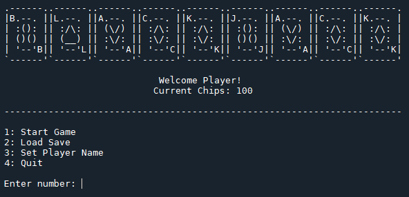
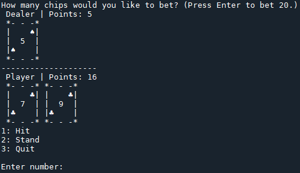

# Blackjack
Part of my portfolio to demonstrate introductory level Python skills as well as basic GitHub commands.

Documentation is based off of Numpy standard, almost all code made from scratch with exception of imported timer library.

Allows the user to play a very basic game of Blackjack, keeps track of chip counts and player name. See how high a chip count you can achieve!